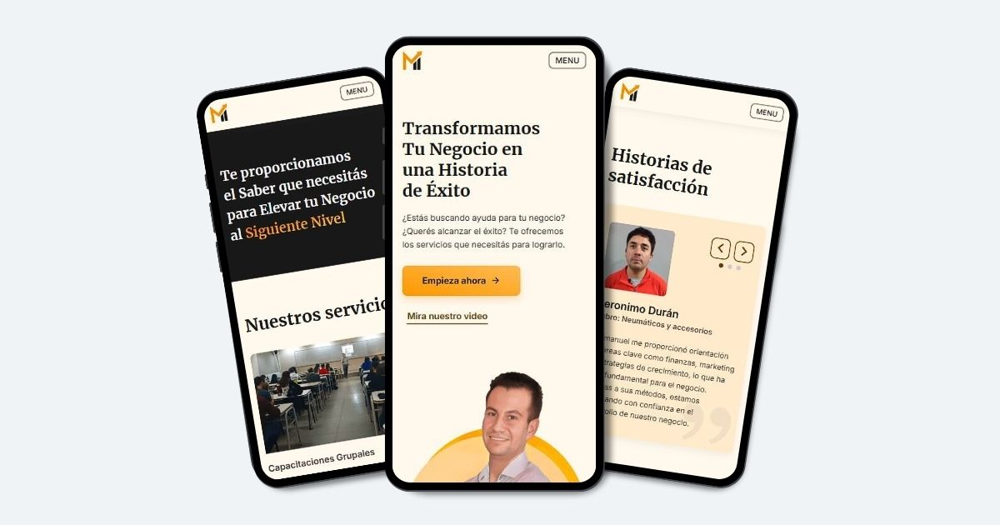

# Sitio web para Emmanuel Mansilla

Junto a un equipo de trabajo, diseñamos y desarrollamos un sitio web para Emmanuel Mansilla, propietario de una Consultora de Negocios.

## Vista previa

## Características

- **Diseño minimalista**: Navegación intuitiva, enfocada en la información clave.

- **Responsivo**: Optimizado para computadoras, tabletas y móviles.

## Equipo de trabajo

**Diseño**:

- Moira Echeverría, Diseñadora UX/UI.
- Tomás Iannello, Diseñador UX/UI.

**Desarrollo**:

- Gabriel Maine, Desarrollador Frontend.
- Luciano Treachi, Desarrollador Frontend.

## Tecnologías Utilizadas

- Vite
- React 18
- CSS Modules

## Explora el sitio web

Accede aquí → [Consultora de negocios](https://consultoradenegocios.vercel.app/)
